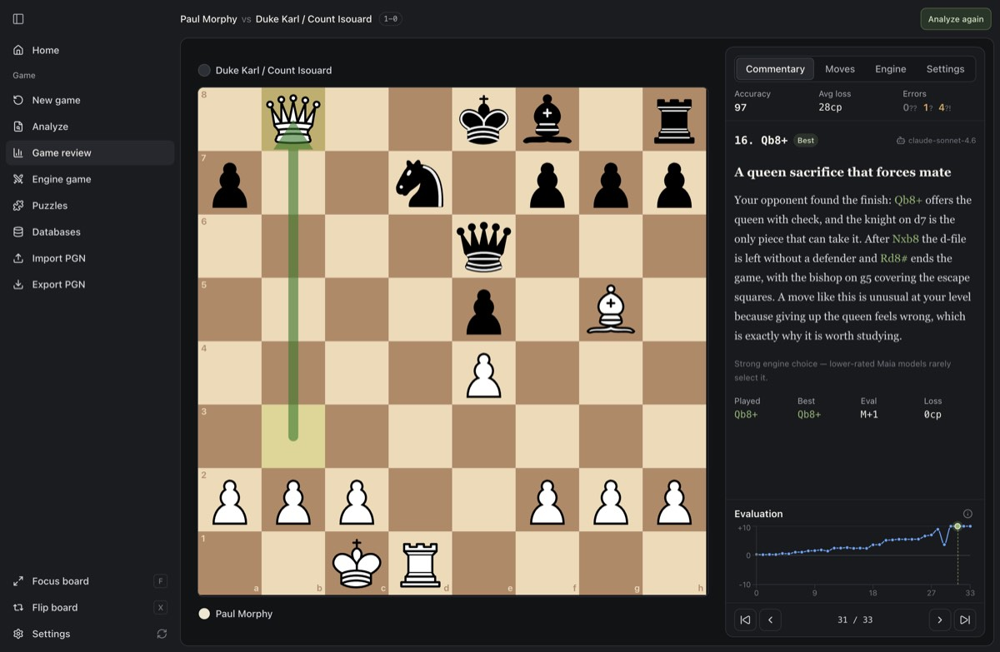

# Chaturanga

A desktop chess app for studying your own games. It reviews every move with Stockfish, shows how
players at your rating would likely have played (Maia), and explains the key moments in plain
language.



- **Game review:** accuracy, move grades, eval graph, and a coach that explains each move
- **Analysis:** live engine lines and a move tree with variations
- **Play:** games against an engine with clocks, plus puzzles from the Lichess database
- **Local-first:** games and engines stay on your machine; AI commentary runs through your own
  OpenRouter key

## Download

Get the latest build from [Releases](https://github.com/ayush-porwal/chatrunga/releases)
(macOS, Windows, Linux).

## Development

Requires Node 24 and pnpm 11.

```bash
pnpm install
pnpm dev     # run the desktop app
pnpm test    # run tests
pnpm lint    # lint
```

Releases are built by the manual **release** workflow in GitHub Actions.
