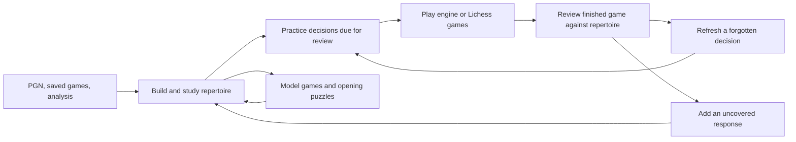

# Repertoire feature design

**Application:** Chaturanga desktop  
**Status:** Proposed implementation design  
**Prepared:** 29 September 2026  
**Code baseline:** Inspected at `a290535`; integration references rechecked at `f9ab079` while other code changes were in progress  
**Scope:** Product behavior, integration, domain model, persistence, technical boundaries, delivery plan, and acceptance criteria

## 1. Product direction

Add a personal opening repertoire that helps a player decide what to play, understand the resulting positions, remember their choices, and improve those choices after actual games.

The central loop is:



A repertoire is more than an annotated PGN and more than a sequence with one correct answer. It contains a player's intended moves, the opponent's covered responses, explanatory material, and a record of decisions practiced. A player can intentionally maintain multiple repertoires for the same color. Each remains independent.

The feature should feel like another use of Chaturanga's existing board, move tree, Library, engine analysis, and Game review. It must work locally without a Lichess account, downloaded puzzle database, running engine, or OpenRouter key.

### Goals

- Create a White or Black repertoire manually, from PGN, or from an existing game or analysis variation.
- Organize opening knowledge into chapters with comments, arrows, variations, and clear training boundaries.
- Practice meaningful decisions, accepting every move the user has explicitly approved for that position.
- Recognize transpositions without losing the authored move order and its context.
- Find the first useful difference between a finished game and the chosen repertoire; turn it into a study or practice action.
- Keep source games intact and make movement between features preserve the player's place.

### First-release boundaries

Support standard chess and a single local user's data. Sharing, collaborative editing, cloud synchronization, a course marketplace, automatic theory generation, Chess960, and live-game opening assistance are outside the first release. Online opening statistics and direct Lichess Study import can follow reliable local PGN interoperability.

## 2. Research: what established chess apps teach us

Research used first-party public product pages, help documentation, and announcements. It did not involve signing in, buying courses, or completing end-to-end training sessions. The Lichess feature articles are historical descriptions; they establish the documented model rather than verify every current UI detail. Chessable's homepage returned HTTP 403; its repertoire feature was verified through Chess.com's official April 2026 announcement. Chessbook's public page was client-rendered, so its observations below are limited to its indexed first-party onboarding text. No pricing or subscription assumptions are needed for this design.

| Product                                | Verified behavior                                                                                                                                                                                                                                                                                                                                                                                                                                                                                                                                                                 | Decision for Chaturanga                                                                                                                                                                         |
| -------------------------------------- | --------------------------------------------------------------------------------------------------------------------------------------------------------------------------------------------------------------------------------------------------------------------------------------------------------------------------------------------------------------------------------------------------------------------------------------------------------------------------------------------------------------------------------------------------------------------------------- | ----------------------------------------------------------------------------------------------------------------------------------------------------------------------------------------------- |
| **Lichess Studies**                    | Chapters have their own starting positions and variation trees. Comments and board annotations accompany the moves; multi-chapter PGN export preserves the study's chess content. [Official Study introduction](https://lichess.org/@/lichess/blog/study-chess-the-lichess-way/V0KrLSkA).                                                                                                                                                                                                                                                                                         | Use familiar chapters and annotations, support custom FEN roots, and treat export as a core capability.                                                                                         |
| **Lichess Interactive Lessons**        | Lessons support prompts, optional hints, and feedback for authored incorrect moves. Its documented study modes distinguish analysis, hidden continuations, interactive lessons, and practice against the computer. [Official lesson explanation](https://lichess.org/@/lichess/blog/interactive-lessons/WtDErSQA).                                                                                                                                                                                                                                                                | Separate study, recall, and engine sparring. Hide answer-bearing material during recall; offer explanations after the answer.                                                                   |
| **ChessTempo Opening Training**        | Supports branch training, depth limits, spaced repetition, and position-based transposition handling. Its manual describes sharing scheduling across overlapping repertoires. [Opening training manual](https://chesstempo.com/manual/en/manual.html).                                                                                                                                                                                                                                                                                                                            | Deduplicate decisions within a repertoire. Keep progress separate across repertoires so different intended move choices cannot silently influence each other.                                   |
| **ChessTempo's game integration**      | Finished games can be checked for repertoire deviations, and uncovered opponent lines can become repertoire additions. [Official product page](https://chesstempo.com/opening-training/).                                                                                                                                                                                                                                                                                                                                                                                         | Make post-game review a first-class entry point into repertoire improvement.                                                                                                                    |
| **Chessable Repertoire / MoveTrainer** | The April 2026 repertoire announcement describes combining selected lines or chapters, adding alternative moves and comments, and including model-game or structural material without changing original courses. MoveTrainer documentation describes increasing review intervals after success and shorter intervals after mistakes, with timers per move. [Repertoire announcement](https://www.chess.com/news/view/announcing-chessable-repertoire), [scheduling documentation](https://support.chess.com/en/articles/10319322-how-does-the-spaced-repetition-scheduling-work). | Copy selected material rather than mutate its source. Allow reference chapters alongside opening lines, and make learning depth adjustable. Use our own explicitly versioned scheduling policy. |
| **Chess.com Openings**                 | Opening pages provide explanations and follow-up moves with access to example games. [Official help](https://support.chess.com/en/articles/8708943-what-are-chess-openings).                                                                                                                                                                                                                                                                                                                                                                                                      | Connect memorized moves to model games and plans; keep opening recognition separate from the user's actual repertoire membership.                                                               |
| **Chessbook**                          | Its public onboarding introduces adding repertoire moves and practicing them with spaced repetition. [First-party onboarding](https://chessbook.com/).                                                                                                                                                                                                                                                                                                                                                                                                                            | Make the first useful result small: create a repertoire, add a short branch, and practice immediately. Advanced capabilities were not verified.                                                 |

**Design synthesis:** use chapter-based authorship, position-based recall, and post-game improvement together. These are design choices informed by the comparison, not claims that competitors implement our precise model. Lichess Studies and interactive lessons should not be represented as verified equivalents of a persistent spaced-repetition repertoire scheduler.

## 3. Existing foundations and integration constraints

The current application already provides most of the visual and chess infrastructure. The following references describe inspected code; proposed files and API additions later in this document do not exist yet.

| Existing foundation          | Relevant code                                                                                                                                                                                                                                                                                                                                                                                                      | Reuse or required extension                                                                                                                                                                                      |
| ---------------------------- | ------------------------------------------------------------------------------------------------------------------------------------------------------------------------------------------------------------------------------------------------------------------------------------------------------------------------------------------------------------------------------------------------------------------ | ---------------------------------------------------------------------------------------------------------------------------------------------------------------------------------------------------------------- |
| Desktop shell and navigation | [App.tsx](/Users/ayush.porwal/Documents/workspace/chaturanga/apps/desktop/src/renderer/src/app/App.tsx), [Router.tsx](/Users/ayush.porwal/Documents/workspace/chaturanga/apps/desktop/src/renderer/src/app/Router.tsx), [AppSidebar.tsx](/Users/ayush.porwal/Documents/workspace/chaturanga/apps/desktop/src/renderer/src/app/AppSidebar.tsx)                                                                      | Add a Repertoire entry and routes inside the existing shell. The app currently combines internal views with a hash route for Game review; extend that arrangement deliberately.                                  |
| Reusable board layout        | [BoardWorkspace.tsx](/Users/ayush.porwal/Documents/workspace/chaturanga/apps/desktop/src/renderer/src/features/board/BoardWorkspace.tsx), [BoardView.tsx](/Users/ayush.porwal/Documents/workspace/chaturanga/apps/desktop/src/renderer/src/features/board/BoardView.tsx), [ReviewBoard.tsx](/Users/ayush.porwal/Documents/workspace/chaturanga/apps/desktop/src/renderer/src/features/game-review/ReviewBoard.tsx) | Reuse layout, appearance, motion, and Chessground. BoardView currently owns game/puzzle interactions through stores; ReviewBoard is controlled but read-only. Extract a controlled interactive board boundary.   |
| Variation display            | [TreeView.tsx](/Users/ayush.porwal/Documents/workspace/chaturanga/apps/desktop/src/renderer/src/features/game/TreeView.tsx), [MoveList.tsx](/Users/ayush.porwal/Documents/workspace/chaturanga/apps/desktop/src/renderer/src/features/game/MoveList.tsx)                                                                                                                                                           | TreeView accepts nodes and selection callbacks; reuse it. MoveList is coupled to the game store, so repertoire needs its own adapter and commands.                                                               |
| Chess and PGN                | [position.ts](/Users/ayush.porwal/Documents/workspace/chaturanga/packages/shared/src/chess/position.ts), [pgn.ts](/Users/ayush.porwal/Documents/workspace/chaturanga/packages/shared/src/chess/pgn.ts), [chess.ts](/Users/ayush.porwal/Documents/workspace/chaturanga/packages/shared/src/types/chess.ts)                                                                                                          | Reuse legality, SAN/UCI conversion, MoveNode, and annotations. Add repertoire-specific import validation and position indexing.                                                                                  |
| Local persistence and bridge | [db/index.ts](/Users/ayush.porwal/Documents/workspace/chaturanga/apps/desktop/src/main/db/index.ts), [db/repositories.ts](/Users/ayush.porwal/Documents/workspace/chaturanga/apps/desktop/src/main/db/repositories.ts), [chaturanga-api.ts](/Users/ayush.porwal/Documents/workspace/chaturanga/packages/shared/src/ipc/chaturanga-api.ts)                                                                          | Extend the existing SQLite database and typed preload API. Use separate repertoire tables and repositories.                                                                                                      |
| Existing game Library        | [RecentGames.tsx](/Users/ayush.porwal/Documents/workspace/chaturanga/apps/desktop/src/renderer/src/features/game/RecentGames.tsx), [saved-game.ts](/Users/ayush.porwal/Documents/workspace/chaturanga/apps/desktop/src/renderer/src/features/game/saved-game.ts)                                                                                                                                                   | Add contextual copy/link actions. Keep source-game IDs distinct from repertoire and chapter IDs.                                                                                                                 |
| Game review                  | [GameReviewPage.tsx](/Users/ayush.porwal/Documents/workspace/chaturanga/apps/desktop/src/renderer/src/features/game-review/GameReviewPage.tsx)                                                                                                                                                                                                                                                                     | Add an opening comparison panel independent of engine review and AI commentary.                                                                                                                                  |
| Engine play and analysis     | [PlayPage.tsx](/Users/ayush.porwal/Documents/workspace/chaturanga/apps/desktop/src/renderer/src/features/game/PlayPage.tsx), [useEngineDriver.ts](/Users/ayush.porwal/Documents/workspace/chaturanga/apps/desktop/src/renderer/src/app/useEngineDriver.ts), [engine-manager.ts](/Users/ayush.porwal/Documents/workspace/chaturanga/apps/desktop/src/main/engine/engine-manager.ts)                                 | Hand a copied repertoire position/line to normal analysis or engine play. Play setup currently resets the board, so starting from a repertoire position requires an explicit extension.                          |
| History and practice setup   | [history-store.ts](/Users/ayush.porwal/Documents/workspace/chaturanga/apps/desktop/src/renderer/src/stores/history-store.ts), [PuzzlePage.tsx](/Users/ayush.porwal/Documents/workspace/chaturanga/apps/desktop/src/renderer/src/features/puzzles/PuzzlePage.tsx)                                                                                                                                                   | Extend history with repertoire identity and cursor. Introduce persistent setup drafts for repertoire; puzzle filters currently use page-local state and need a draft handoff for the proposed puzzle connection. |

Two concrete prerequisites deserve special attention:

1. `importPgnText` currently imports only the first game and warns about the rest; its recursive importer can skip an illegal move. Repertoire import must enumerate every selected game/chapter and report invalid branches explicitly.
2. `exportGameToPgn` currently serializes supported GameHeaders without emitting `SetUp` and `FEN`. A repertoire chapter with a custom root needs those tags, correct root-based move numbering, and retained original headers. Add a shared, backward-compatible export option and regression tests.

## 4. Feature scope and prioritization

| Capability                                                          | Initial release                                | Follow-up                                         |
| ------------------------------------------------------------------- | ---------------------------------------------- | ------------------------------------------------- |
| White/Black repertoires; chapters; local search; archive; duplicate | Required                                       | Folder collections and bulk organization          |
| Manual entry, variation editing, comments, arrows, study boundary   | Required                                       | Rich teaching templates                           |
| PGN import preview, multi-game import, PGN export, native backup    | Required                                       | Direct Study URL import and optional sync         |
| Due-decision practice; new-decision learning; line rehearsal        | Required                                       | Exact-alternative drills and adaptive scheduling  |
| Transposition recognition within repertoire                         | Required                                       | Explicit repertoire-to-repertoire comparison      |
| Add from Library, board, and finished Game review                   | Required                                       | Bulk suggestion inbox from recent games           |
| Finished-game deviation report; targeted refresh                    | Required                                       | Encounter-frequency recommendations               |
| Analyze selected position through existing analysis workspace       | Required                                       | Inline engine panel with separate ownership       |
| Continue against engine from selected position                      | Required for integrated release                | Scripted opening sparring before engine takeover  |
| Related saved/model games                                           | Required                                       | Local game-position index and explorer statistics |
| Opening-filter handoff to Puzzles                                   | Follow-up; existing filter support can be used | Exact structural/position matching                |
| Online statistics, automatic line generation, collaboration         | Excluded                                       | Separate designs                                  |

An editor-only internal milestone is useful, but the first user-facing release should include practice and the finished-game feedback loop. Those connections give the feature its purpose.

## 5. Information architecture and screens

### 5.1 Repertoire hub

Add **Repertoire** to the sidebar near Analyze and Game review. Keep the existing sidebar's collapsed icon rail, tooltips, active state, and board-only actions.

The hub uses the app's Page/PageHeader components and provides:

- **Review due** as the primary action when eligible decisions exist; **Create repertoire** for an empty collection.
- White/Black/All filters, title/tag search, and an archived toggle.
- Each repertoire's color, chapter count, unique trainable decisions, due count, and last studied date.
- Actions to Study, Practice, Import, Export, Duplicate, Archive, and Delete.
- A quiet **Continue studying** action restoring the last chapter and node, distinct from starting a practice queue.

Creation asks for name and color, then offers **Start from initial position**, **Import PGN**, **Use current game/line**, or **Start from FEN**. Custom positions are validated before creating a chapter. Color describes the player's intended side; flipping the board never changes it. Changing color after content exists requires creating a new repertoire copy and rebuilding its decision policies/progress.

Suggested examples are empty titles such as “My 1.e4 repertoire” and “Black against 1.e4”; do not ship unreviewed theory disguised as a complete opening course.

### 5.2 Study workspace

Use BoardWorkspace with the same board geometry, piece settings, focus mode, and move navigation as Analyze and Game review.

```text
Repertoire > My White repertoire > Italian Game       Saved · Practice

┌─────────────────────────┬───────────────────────────────────────────┐
│                         │ Chapters | Moves | Notes | Related games  │
│          Board          │                                           │
│                         │ 1. e4 e5  2. Nf3 Nc6  3. Bc4 Bc5          │
│                         │                                           │
│                         │ Your choices here: c3 [Preferred], d3      │
│                         │ After 4.c3: ...Nf6, ...d6                  │
│                         │ Transposes to: chapter / move              │
├─────────────────────────┼───────────────────────────────────────────┤
│ Move navigation         │ Analyze · Play from here · Add variation  │
└─────────────────────────┴───────────────────────────────────────────┘
```

Chapter navigation offers ordered titles, opening/reference type, enabled state, and due count. The selected tree occurrence remains the source of the displayed move path and annotations.

At a player-to-move position, the choices panel distinguishes **Preferred**, **Accepted alternative**, and **Reference only**. At an opponent-to-move position it distinguishes **Covered response** and **Reference only**. PGN mainline order is a presentation choice; it does not by itself define correctness after import confirmation.

Study commands:

- Play a legal move to create or select an occurrence; default new moves to reference until explicitly accepted/covered, with a one-click choice action.
- Promote/reorder a variation, rename/reorder a chapter, edit comments/NAGs, and draw arrows/highlights.
- Set a position prompt and optional hidden hint separately from explanatory comments.
- Set **Start training here** and **Stop this branch here**. Prefix moves remain useful study context but produce no training cards before the start boundary.
- Mark an own-side move accepted or preferred. Preferred must also be accepted; choosing another accepted move remains correct.
- Disable a branch for practice without deleting study material. Show the effect on unique decisions before committing.
- Link a source/model game and open it at the relevant node.

Removing a subtree affects its own occurrences, not every transposed copy. Preview how many decisions become unsupported, and offer Undo while the editor remains open. A shared preferred move or prompt shows that it applies to all occurrences of this position in this repertoire.

### 5.3 Practice setup and workspace

Three clearly named modes:

| Mode               | User experience                                                                             | Progress effect                                                                    |
| ------------------ | ------------------------------------------------------------------------------------------- | ---------------------------------------------------------------------------------- |
| **Review due**     | Recall decisions whose review times have arrived, then optional new decisions.              | Updates scheduled progress.                                                        |
| **Learn new**      | Preview an unseen position, its choices and explanation, then test it after other material. | Preview itself gives no success credit; recall creates the first scheduled result. |
| **Rehearse lines** | Play authored lines from a chapter/root with opponent responses supplied automatically.     | Session results only; does not advance scheduled mastery in v1.                    |

Setup filters by repertoire, chapter(s), optional branch, maximum learning depth, and card limit. Depth counts plies from the chapter's root, includes the player move being tested, and is shown with a move-number preview for custom roots. Default to 20 due decisions and at most five new ones after due work; allow finishing without introducing new material. Store setup as a repertoire draft so a Settings detour and Back preserve it.

Review due presents one decision at a time. Show the selected line's lead-up as an optional quick replay; the final board always uses that occurrence's full FEN. The player moves only their repertoire color. Hide future notation, choice names, authored arrows, answer-bearing notes, engine evaluation, and reference games until the answer is finalized. A safe prompt may remain visible.

An accepted UCI move finishes the card. No comparison to engine ranking is necessary. If there are several accepted choices, recalling any one succeeds; the summary explicitly describes **decision recall**, not mastery of every alternative. Training each alternative separately is a future mode.

For a legal move outside the approved set, say **“This move is outside your repertoire”**, retain the position, and allow another attempt. Do not call it a chess blunder. If the author supplied feedback for that move, display it after the failed attempt. Illegal moves are rejected before grading. Promotions, including underpromotions, are checked using the complete UCI move.

Hint stages: reveal the optional authored hint, then indicate the preferred piece, then reveal a move. Any hint makes the attempt assisted. Reveal finalizes an unsuccessful recall rather than awarding credit for copying the answer.

In line rehearsal, an accepted move that belongs to another branch receives **“That is a repertoire choice in another line”**. Offer to follow its known occurrence or retry the selected branch. This is not a memory failure. Opponent replies select enabled authored children; prioritize previously unseen branches with deterministic rotation, not an engine's preferred response. End at an authored stop/leaf or the depth limit. Never auto-expand a transposition indefinitely.

The session summary shows unaided recalls, assisted answers, missed decisions, practiced chapters, and links to **Study missed positions** and **Rehearse this branch**. Avoid a global rating or an unexplained percentage labelled “mastered.”

## 6. Integration with the existing application

### 6.1 Home

Add a compact **Repertoire review: N decisions due** card and **Continue repertoire study** when relevant. Keep the existing recent-game/continue-game content. Repertoire operations must not become synthetic games in RecentGames.

### 6.2 Library and Analyze

Expose **Add to repertoire** on a saved game's context actions and on the selected board variation. The dialog chooses destination repertoire/chapter and scope:

- Root-to-selected-node path.
- Selected subtree, with a choice to retain the original root/path or create a standalone chapter from the selected FEN.
- Entire game as a reference chapter.

Default a complete game to **Reference** rather than treating all its moves as a recommendation. Opening excerpts require an explicit endpoint and choice-policy preview. Preserve comments and arrows, record source provenance, and leave the game/review unchanged.

From Study, **Analyze** creates an independent game workspace snapshot with a new unsaved game identity, the selected chapter path, and a return target. It uses the existing engine setup and analysis feature. Variations explored there enter the repertoire only through **Add to repertoire** with a visible diff. Engine PVs are suggestions, never automatic acceptance policies.

### 6.3 Game review: repertoire comparison

Add an **Opening** section/tab beside the current review sections. It runs locally from the recorded moves and repertoire index and is available even when no engine review or AI commentary exists.

The user selects player color and repertoire. Remember the last selection per color; never guess the user's side from board orientation. A connected Lichess account or local sparring provenance can provide a suggested side, with a visible override. If multiple repertoires match, show their names rather than silently combining them.

The comparison distinguishes:

| Status                      | Meaning                                                                          | Primary action                                            |
| --------------------------- | -------------------------------------------------------------------------------- | --------------------------------------------------------- |
| In repertoire               | Player used an approved choice at a recognized, trainable decision.              | Open the matching chapter.                                |
| Player deviation            | Player moved outside the accepted set at a recognized decision.                  | Practice that decision or inspect the played alternative. |
| Uncovered opponent response | Opponent chose a legal move not covered by the active opening material.          | Add a response branch at this position.                   |
| Preparation ends            | An authored endpoint was reached, or no further planned decisions were supplied. | Study the resulting position / extend deliberately.       |
| No applicable chapter       | Game root/path cannot be matched to the selected repertoire.                     | Choose another repertoire or create a chapter.            |

Algorithm:

1. Replay the saved game's mainline from its actual root FEN; build each position key and move label from the position, not odd/even ply assumptions.
2. Match active opening occurrences by position key. A custom-root chapter can become applicable when that position is reached; mark earlier game moves as outside its scope.
3. At a player decision, compare the played UCI against the repertoire-wide supported accepted choices. A covered opponent edge is matched similarly against covered occurrences.
4. Report the earliest actionable player deviation or coverage gap, with the board **before** that move, played move, expected choices, and chapter links. Recognized chapter ends are preparation boundaries, not failures.
5. After a deviation, scan for later matched positions and show **“Returned to known preparation by transposition”** as additional context. Preserve the initial issue. Bound work by the game's finite mainline.

Training boundaries determine the comparison's coached scope: positions before a chapter's training start are context-only; explicit stop occurrences end that route. A continuing occurrence in another active chapter may extend the coverage; show which chapter supplied it. Never infer coverage of every legal opponent move or claim a repertoire is theoretically complete.

Keep repertoire adherence separate from engine move classification and game accuracy. A perfectly playable move can be outside the user's plan; a repertoire move can still receive poor engine evaluation.

**Refresh this decision** starts a targeted queue without marking a new lapse merely because the real game deviated. **Add opponent response** stages the actual response as a covered reply (so it trains once the player's continuation is accepted), then asks the player to choose their continuation through normal study/analysis. **Adopt played alternative** shows the policy change and its effects before committing.

Cache comparison by game-content hash, repertoire revision, player color, and key-algorithm version. Cursor changes or AI commentary changes alone need not rebuild it. Opening comparison is derived data, not part of the existing engine GameReview schema.

### 6.4 Play and Lichess

**Play from here** carries the selected root/path and repertoire color into existing engine setup. Show the starting-position thumbnail and name. Use an untimed game by default; if a clock is selected, it starts at the handoff, not during prefix replay. Preserve the complete prefix for analysis/repetition history where available. A standalone FEN cannot reconstruct earlier repetition history; label it as a position start.

The current PlayPage resets to the initial board. Extend setup with an explicit initial-session argument instead of calling reset and then patching the board opportunistically. Missing engines route to Settings with a retained launch draft and return target.

The resulting engine game is a normal independently saved game with optional repertoire provenance. Finishing it offers **Review opening** and **Return to repertoire**. Game moves do not edit the repertoire or train its scheduler.

Use existing Lichess finished-game synchronization as an input to the same Library/Game review flow. Do not add a second account/token mechanism. While `selectLiveGameInProgress` is true, block repertoire training, study move suggestions, comparison, engine launches, and transitions that replace the live board. Apply the guard at command boundaries as well as visible buttons. A finish event alone is insufficient if a newer live game has already started.

Direct import of a public Lichess Study is a later adapter. V1 accepts a downloaded Study PGN; it does not assume the existing account/game-sync API imports studies. Private studies, permissions, rate limits, and update/merge behavior need a separate specification before direct sync.

### 6.5 Puzzles, Databases, and model games

Reference chapters link to source games in the existing Library. **Related games** initially shows explicitly attached games, with source labels and optional linked node IDs. If a source game was deleted, retain the copied chapter and show that the link is unavailable.

Puzzles already support opening-tag filters. A follow-up **Practice tactics from this opening** action can pass verified tags into a new persistent puzzle setup draft; retain rating/length/theme preferences. Explain that matching tags produce related tactical exercises, not exact repertoire positions. If no compatible database exists, open Databases and return to the same draft after installation. Do not fabricate mappings from free-text repertoire names to database tags.

The installed-database metadata API is not an opening explorer. Querying model games by position, empirical move frequencies, or pawn structures requires a real game-position index or a separate service. Treat that as a follow-up dependency rather than promising it through the current database list.

## 7. Domain model and chess invariants

### 7.1 Authoritative data and derived views

Use **chapter occurrence trees for authored content**, **position-keyed policies for intended player choices**, and a **derived position index** to connect them. They describe different concerns:

- Chapter tree: exact authored move order, occurrence comments/arrows, branch order, covered-opponent markers, training boundaries, source metadata.
- Decision policy: approved UCI choices, preferred choice, prompt/hint, and wrong-move feedback at a position within one repertoire.
- Derived index: which active chapter occurrences support each policy and how to navigate to them.

Reuse MoveNode for tree nodes, with chapter-local IDs and separate node metadata. Do not persist a second mutable position graph as another source of the same moves. The index is disposable and rebuilt from a validated revision.

Every effective accepted move must be legal at its position and have at least one supporting occurrence in an enabled opening chapter inside its authored training boundaries. Accepting a new move from a policy panel must create or select that occurrence in the same transaction. Stored policies can retain inactive choices when their chapters/branches are disabled; the effective accepted set is the stored set intersected with currently supported occurrences. Reference chapters cannot create training cards merely by containing a move. Session chapter/branch filters do not redefine this effective set. If the stored preferred choice is inactive, hints use the first supported accepted choice without overwriting the preference.

Node metadata records whether an edge is reference-only, an included player continuation, or a covered opponent response; start/stop markers and disabled ancestry determine eligibility. An approved UCI choice may apply to another included occurrence at the same position, but never turns a reference-only route into a practice route. Index construction explicitly computes these states rather than treating every descendant as active.

At a transposed position, a policy is repertoire-wide. If two chapters suggest different first choices, import/edit preview shows the resulting alternatives and asks for the preferred choice. There are no hidden chapter-specific overrides in v1. A user who wants genuinely different strategies can maintain separate repertoires.

Chapter or branch filters determine **which decisions are queued**. For a queued decision, every supported accepted move in the repertoire remains correct, even if its continuation lies outside the selected chapter filter. This rule prevents a correct alternative from becoming a false failure during scoped practice. Line rehearsal handles out-of-branch choices explicitly as described above.

### 7.2 Position identity

Define a versioned `positionKey` from validated standard-chess state:

- Piece placement.
- Side to move.
- Castling rights in normalized order, preserving rights even when castling is currently obstructed.
- En-passant square only when a legal en-passant capture exists, including king-safety validation.

Exclude halfmove/fullmove counters from this opening-decision key. Keep the full FEN and actual path for rendering, move numbering, engine calls, and history-sensitive rules. A decision key is not a general-purpose full game-state or engine-evaluation cache key.

Implement normalization with the existing chessops legality helpers; do not blindly hash the first four FEN fields. Store the canonical string, with an explicit version prefix, for collision-free comparisons at this scale. Any future hashing must verify canonical equality. Never reuse a board-thumbnail string or SAN as a position key.

Custom-root Black-to-move chapters derive the player turn and move number from FEN. Orientation is presentation only. Reject unsupported variant tags rather than interpreting them as standard chess.

### 7.3 Transpositions, loops, and endpoints

Distinct node IDs remain distinct occurrences even when their position keys match. A transposition badge links to the other chapter/node occurrences; clicking it is explicit navigation.

Training uses one recall card per `(repertoireId, positionKey)` with that repertoire's player color and approved choices. It does not count repeated arrivals as new decisions. Chapter totals can overlap; repertoire totals must count unique keys.

Finite occurrence trees may contain repeated chess positions. Preserve them for study and rehearsal. Do not recursively unfold index links: repetition in chess positions does not create infinite editor nodes. Rehearsal follows the authored occurrence path and stops at an endpoint/depth bound.

Endpoints belong to occurrences/routes, not to a globally shared position. A position can end one chapter while another chapter continues. Editing one route must not erase a transposed route's annotations or stop markers.

## 8. Persistence and scheduling

### 8.1 Proposed SQLite tables

Use the existing `chaturanga.sqlite` database, WAL mode, and foreign-key support. Keep repositories focused in new repertoire modules rather than enlarging the generic repositories file indefinitely.

| Table                          | Essential fields / relationships                                                                                                                                                                                                       |
| ------------------------------ | -------------------------------------------------------------------------------------------------------------------------------------------------------------------------------------------------------------------------------------- |
| `repertoires`                  | `id`, `name`, `color`, `description`, `tags_json`, `revision`, `archived_at`, `created_at`, `updated_at`                                                                                                                               |
| `repertoire_chapters`          | `id`, `repertoire_id`, `title`, `sort_order`, `kind` (`opening`/`reference`), `enabled`, `root_fen`, `headers_json`, `tree_json`, `node_metadata_json`, `revision`, timestamps                                                         |
| `repertoire_decisions`         | Composite key `(repertoire_id, position_key)`; `accepted_ucis_json`, `preferred_uci`, `prompt`, `hint`, `wrong_move_feedback_json`, `paused`, `acceptance_fingerprint`                                                                 |
| `repertoire_position_index`    | Derived occurrence rows: `repertoire_id`, `chapter_id`, `node_id`, `position_key`, `scope_state`, `revision`, `key_version`; index by repertoire/key and chapter/node                                                                  |
| `repertoire_progress`          | Composite key `(repertoire_id, position_key)`; `stage`, `due_at`, `last_attempt_at`, `lapses`, `unaided_successes`, `acceptance_fingerprint`, `scheduler_version`, `suspended`                                                         |
| `repertoire_practice_sessions` | `id`, `repertoire_id`, `mode`, `scope_json`, `snapshot_revision`, `queue_json`, `card_state_json` (hint/first-answer state), `cursor`, `status`, timestamps                                                                            |
| `repertoire_attempts`          | Unique `attempt_id`; `session_id`, `queue_item_id`, `is_final_grade`, decision key, sequence, chosen move, hint stage, first-answer outcome, policy fingerprint, effective time; no cascade from decision row so edit history survives |
| `repertoire_game_links`        | `id`, `repertoire_id`, optional `chapter_id`, nullable local `game_id`, optional game node ID, original source metadata, captured path/hash, link kind                                                                                 |
| `repertoire_workspace_state`   | Last chapter/node/orientation and practice setup; preferences only, not another copy of chapter content                                                                                                                                |

Foreign keys cascade when a repertoire is deleted; source-game deletion sets link game IDs to null while preserving provenance and copied material. Add indexes for due selection `(repertoire_id, suspended, due_at)`, chapter ordering, and source-game links. Validate JSON on load; a corrupt chapter should produce a recoverable error without silently replacing it with an empty tree.

Writes use expected repertoire/chapter revisions and one transaction for chapter changes, policy reconciliation, derived-index updates, and progress eligibility. Retain the previous confirmed draft in memory on failure, show an unsaved state, and offer Retry/export. Session state is not stored under the games table.

### 8.2 Proposed scheduling policy v1

Use a small deterministic policy first, version it, and measure its usefulness before replacing it with a more sophisticated model. These intervals are proposed product defaults, not a scientifically validated optimal schedule or a copy of a competitor's algorithm.

| Final first-answer outcome                         | Scheduling result                                                   |
| -------------------------------------------------- | ------------------------------------------------------------------- |
| New, unaided accepted move                         | Stage 1; next review in 1 day.                                      |
| Unaided success on an existing card                | Advance one stage: 1, 3, 7, 14, 30, 60 days; cap at 60 days.        |
| Correct after a hint, without a prior wrong answer | Keep stage unchanged; next review in 1 day.                         |
| Wrong first legal answer or Reveal                 | Reset to stage 0; increment lapses once; next review in 10 minutes. |
| Illegal input, skipped card, abandoned card        | No schedule change.                                                 |

Once a wrong first answer is recorded, retrying correctly on that card does not promote it. Optional same-session reinforcement displays the answer/move again without another scheduled grade. A card becomes gradeable again in a subsequent eligible session.

Record attempt, card state, and progress update atomically and deduplicate by `attempt_id`. Replayed IPC requests return the previous committed result. A unique `(session_id, queue_item_id)` final-grade constraint ensures only one scheduled outcome per item; explicit sequence numbers protect action ordering. Persist hint requests before showing them, and commit a wrong first legal answer immediately. Subsequent retries are ungraded reinforcement, including after restart. The main process reconstructs outcome from this action history rather than trusting a client-reported first answer.

Use main-process timestamps, UTC elapsed intervals, and a monotonic session timer for durations. Clamp scheduling to at least the last stored attempt time if the system clock moves backwards. Timezone changes affect display, not due timestamps. Time spent thinking is informational and does not determine success.

Queue order is overdue cards first, then eligible unseen cards by shallowest authored ply and chapter order, with stable tie-breaking. A filtered scope with no due cards says **“No reviews due in this scope”** and offers Learn new/Rehearse; it never invents due work.

### 8.3 Editing and progress invalidation

- Renaming, reordering, comment edits, and board orientation do not reset recall progress.
- Adding an accepted alternative changes the fingerprint but preserves progress: the existing recalled choice remains supported. V1 measures recall of any intended choice.
- Removing an accepted move resets the decision to due now with a visible “choices changed” reason, without adding a memory lapse.
- Removing the final supporting occurrence suspends the decision; retain history so Undo/restoring identical choices can recover it.
- Disabled chapters/branches and archived repertoires contribute no due cards. Re-enabling unchanged supported choices restores existing timestamps.
- Duplicating a repertoire copies content/policies/provenance but starts fresh progress by default.
- An active practice session uses a frozen policy snapshot. If edits remove/change a queued decision, discard its uncommitted grade and offer a refreshed queue. Pure note edits need not discard recall results. Do not grade against a moving accepted set.

## 9. Technical boundaries and proposed API

### 9.1 Module ownership

| Layer               | Proposed modules                                                                                                                                                          | Responsibility                                                                                                                    |
| ------------------- | ------------------------------------------------------------------------------------------------------------------------------------------------------------------------- | --------------------------------------------------------------------------------------------------------------------------------- |
| Shared domain       | `packages/shared/src/types/repertoire.ts`; `chess/repertoire-position.ts`, `repertoire-index.ts`, `repertoire-compare.ts`, `repertoire-scheduler.ts`, `repertoire-pgn.ts` | Pure types, canonical keys, index construction, comparison, scheduling, import/export validation; no React/Electron dependencies. |
| Main process        | `main/repertoire/repository.ts`, `service.ts`, `import-worker.ts`; `main/ipc/repertoire-handler.ts`                                                                       | SQLite, transactions, revision checks, grading authority, import jobs and file operations.                                        |
| Renderer            | `features/repertoire/` with hub, study, trainer, import preview, comparison panel, and source picker                                                                      | UI and orchestration through the typed API.                                                                                       |
| Renderer state      | `stores/repertoire-workspace-store.ts`, `repertoire-practice-store.ts`; `queries/repertoire.ts`                                                                           | Ephemeral drafts/cursors and narrow subscriptions; durable content fetched through query cache.                                   |
| Shared presentation | Controlled interactive board and generic tree/navigation adapters                                                                                                         | Visual reuse without enrolling repertoire state in game autosave or engine-match behavior.                                        |

The repertoire store must not load chapters into the global game store just to reuse BoardView. `useGameAutosave` currently watches that store; doing so would create synthetic saved games and could interfere with review/engine state. Extract board props for `fen`, `orientation`, legal interaction, annotations, and move/promotion callbacks while retaining existing GameWorkspace behavior through an adapter.

The current engine driver and analysis status panels also assume game-store ownership. V1 Analyze is an explicit independent snapshot handoff; do not mount the current engine panel inside repertoire and expect it to analyze the chapter automatically. Recent engine work already supplies search identities and game-position ownership. Any future inline repertoire analysis must extend that existing isolation to repertoire/chapter/node requests and define cancellation/engine arbitration, rather than treating the game store as its owner.

### 9.2 Typed IPC surface

Add `window.chaturanga.repertoires` to ChaturangaApi and preload. Proposed operations:

```ts
list(filters): Promise<RepertoireSummary[]>
get(id): Promise<RepertoireDetail>
create(input): Promise<RepertoireDetail>
updateMetadata(id, expectedRevision, patch): Promise<RepertoireDetail>
saveChapter(input): Promise<ChapterSaveResult> // policy/index reconciliation
updateDecision(input): Promise<DecisionSaveResult>
removeChapter(input): Promise<RepertoireChangeResult>
duplicate(input): Promise<RepertoireDetail>
archive(input): Promise<RepertoireChangeResult> // reversible
remove(input): Promise<void> // includes revision check
previewImport(input): Promise<ImportJob>
commitImport(jobId, selections, expectedRevision): Promise<ImportResult>
cancelImport(jobId): Promise<void>
export(input): Promise<ExportResult> // PGN or versioned native backup
previewBackupImport(input): Promise<BackupImportPreview>
restoreBackup(input): Promise<RepertoireDetail> // validated, default new copy
compareGame(input): Promise<RepertoireComparison>
linkGame(input): Promise<RepertoireGameLink>
startPractice(input): Promise<PracticeSessionSnapshot>
resumePractice(sessionId): Promise<PracticeSessionSnapshot>
recordPracticeAction(input): Promise<PracticeActionResult> // hint, reveal, skip
recordAttempt(input): Promise<AttemptResult> // submitted legal/illegal move
endPractice(sessionId): Promise<PracticeSummary>
saveWorkspace(input): Promise<void>
onChanged(callback): Unsubscribe
onImportProgress(callback): Unsubscribe
```

Exact DTOs should be introduced together with runtime schemas. The renderer can precheck legal moves for immediate interaction, but the main process validates the session, decision fingerprint, legal/accepted UCI, persisted hint usage, and idempotency token before committing a grade. These operations submit moves/actions; the client does not supply a trusted success boolean. A failed action write retains the current card and shows Retry instead of advancing to an unpersisted result.

Event envelopes include repertoire ID, operation/session ID, and revision. Out-of-order events cannot replace newer drafts. Queries use narrow keys such as `['repertoires', 'list']`, `['repertoires', id, 'chapter', chapterId]`, and `['repertoires', id, 'due', scopeHash]`; invalidate relevant summaries and details on commit. Local SQLite IPC queries/mutations explicitly use `networkMode: 'always'` so a disconnected laptop can study and save.

### 9.3 Navigation and lifecycle

Proposed hash-router paths:

```text
/repertoires
/repertoires/:id/chapters/:chapterId
/repertoires/:id/practice/:sessionId
/games/:id/review                 existing route; add opening panel state
```

Extend the app's HistoryEntry union with repertoire hub, study, and practice entries. Study entries store repertoire/chapter ID, node ID, panel, and orientation. Practice entries store session ID/cursor and restore only committed attempts. Root-to-node movement and tabs update the current entry rather than adding one entry per move.

Keep one coordinated command responsible for route, AppView, and history transitions; do not let route effects and button handlers create duplicate entries. Apply the existing navigation-generation pattern to repertoire loads so a late response cannot take over after a newer selection.

Cross-feature commands carry an origin/return target, such as **Study → Analyze → Add variation → Back to same chapter/node**. Flush the last chapter edit before a handoff; on failure, keep its draft and offer Retry or Stay. Deleted chapter history entries fall back to the hub with an explanatory notice. Missing source-game links do not destroy study state.

When leaving practice, cancel pending automatic-reply timers, preserve completed attempts, and leave the current unanswered card ungraded. On restart, resume a session only if its queue remains eligible; otherwise rebuild it and explain changed preparation. Never retain an unconfirmed move as a successful answer.

## 10. PGN interoperability and native backup

### Import

1. Select/paste PGN using existing file-dialog conventions. Parse in a worker with cancellation and progress for large inputs.
2. Enumerate all games; preview proposed chapter names, starting FENs, variations, and import warnings. Default one game to one chapter; offer explicit same-root merge into a chosen chapter.
3. Replay every branch legally from its parent; validate node relationships, bounds, comments, and supported variant. Report exact chapter/path failures. An invalid branch must not disappear silently; the user may explicitly exclude it before commit.
4. Preview player choice policies. Default to the first own-side continuation along covered routes; own-side alternatives are reference until selected. Covered opponent alternatives can be included unless their ancestry was excluded. Show NAG warnings, but never infer intended correctness solely from `$1`/`$2` or branch order.
5. Show conflicts at transposed positions and existing destination policies. The user chooses accepted alternatives and preference before commit. Preserve differing occurrence comments instead of overwriting one with another.
6. Commit selected validated chapters and policy changes atomically. Regenerate chapter-local node IDs when copying to another chapter and retain source references separately.

Merging matches root FEN/position identity and UCI paths, not SAN text. Existing comments remain unless an explicit merge choice appends/replaces them. Re-importing the same selected source should preview duplicates rather than multiply lines invisibly. External PGN need not round-trip arbitrary application metadata, but original unknown headers should be retained in repertoire chapter storage/export.

### Export and backup

**PGN export** is interoperable study content: one game per chapter with comments, NAGs, arrows/highlights where supported by existing annotation helpers, variations, and correct `SetUp`/`FEN` tags for custom starts. Preserve the root's fullmove number and turn in notation. Do not claim PGN contains scheduling, hidden hints, or accepted-choice policies unless a separately documented extension is implemented.

**Native backup** is a versioned JSON document containing repertoires, chapters, policy/boundary metadata, progress, and source provenance. Exclude account credentials, API keys, engine executable paths, and cached evaluation. Validate format/key/scheduler versions and limits before restore. Default restore creates a new repertoire copy; replacing an existing repertoire requires a concrete diff and a retained backup of the replaced data. An explicit include-progress option governs whether historical schedules are restored.

Keep export consistent with a captured revision so edits during serialization cannot produce half-old content. Use a native save dialog, and do not overwrite a destination through an arbitrary renderer-supplied filesystem path.

## 11. Performance, resilience, and visual behavior

The following are engineering targets to validate on a documented reference desktop and packaged build, not measured claims about the current application:

| Interaction / workload                                 | Target                                                                                                                                               |
| ------------------------------------------------------ | ---------------------------------------------------------------------------------------------------------------------------------------------------- |
| Local legal move / recall feedback                     | Visible feedback within 100 ms at p95, independent of engine/network.                                                                                |
| Open a warm chapter up to 5,000 occurrences            | Interactive board within 300 ms at p95.                                                                                                              |
| Hub with 100 repertoires and 100,000 total occurrences | Summary query/render within 500 ms at p95; no full-tree loading.                                                                                     |
| Finished-game comparison up to 300 plies               | Within 250 ms at p95 with a current index.                                                                                                           |
| Import up to 100,000 occurrences                       | Cancellable progress; no parser task blocks renderer/main event loops for more than 50 ms. Total duration measured before choosing a release budget. |

Implementation rules:

- Query aggregate counts, not every tree, for hub/Home cards. Load the selected chapter only.
- Build `nodesById`, children, parent-path, and position lookup maps once per chapter revision. Never traverse the entire repertoire on each board move.
- Keep parsing/key/index preparation in workers for bulk operations. The synchronous main SQLite connection performs short bounded interactive transactions, not full-file parsing. Bulk import commits run through a dedicated writer worker using its own WAL connection; serialize every repertoire write through one async service write gate (the commit holds it), keep reads on deferred transactions that never take the write lock, publish change events only after commit, and handle SQLite busy timeouts without blocking the main event loop. Failed/canceled pre-commit jobs leave existing data intact; cancellation after commit reports completion rather than implying a rollback.
- Incrementally replace a changed chapter's derived index; detect stale revisions. If a background rebuild is required, leave last confirmed study content usable but disable training/comparison against stale policy/index combinations.
- Keep React subscriptions narrow, matching the existing shell's approach. Board movement should not rerender the hub, every chapter row, or import dialog.
- Collapse long variation branches and add tree windowing when the representative large-chapter benchmark requires it. Do not cache every chapter FEN/thumbnail twice in global stores.
- Bound imports by bytes, game count, occurrences, nesting depth, and comment size before committing (a comment over its limit, measured without annotation tags, rejects only its game). Proposed defaults: 20 MiB input, 1,000 chapters per import, 100,000 occurrences, and 128 variation nesting levels; return an actionable limit error. Confirm limits through stress tests rather than truncating material.
- Use cancellation/job tokens for import, delayed practice replies, and analysis handoffs. Late work must not update a new owner/session.

Reuse existing semantic colors, typography, buttons, notices, segmented controls, skeletons, and motion settings. Accepted/preferred/reference states need text or icons as well as color. Practice feedback uses a polite live region and should not steal board focus. Supply keyboard move entry for the repertoire board, including SAN or square-to-square input and promotion selection, so recall is usable without dragging. Existing F/X focus/flip shortcuts keep their meaning and are disabled in text fields. Honor reduced motion and offer immediate lead-up replay.

Empty, loading, unsaved, failed-import, missing-chapter, deleted-source-game, and no-due-card states each get a specific message and recovery action. A saving error must remain visible until data is saved or exported.

## 12. Delivery plan

### Milestone 1 — domain and persistence

- Add canonical position keys, policy rules, finite occurrence indexing, import validation, and comparison as shared pure modules.
- Add versioned SQLite migrations, repertoire repositories, validation schemas, typed IPC/preload operations, and transaction tests.
- Support creation and validated multi-game import/export, including custom FEN round trips and native backup.

**Exit:** a repertoire survives restart; invalid imports cannot partially corrupt it; transposition policies and source identities are well-defined.

### Milestone 2 — hub and study

- Add Repertoire navigation/routes/history and Home summary query.
- Extract the controlled board adapter without changing existing game/puzzle behavior.
- Build chapter navigation, TreeView adapter, notes/choice panels, boundaries, source links, and revision-aware autosave/Undo.
- Add Library/Analyze copy-to-repertoire workflows.

**Exit:** a player can create, edit, study, export, and return from analysis to the same chapter/node without modifying a source game or creating library entries.

### Milestone 3 — training

- Add practice setup drafts, due/new/rehearsal modes, hidden-answer board state, alternative handling, hints, persisted attempts, and scheduler v1.
- Add resume/end/summary behavior and policy-edit reconciliation.
- Validate offline writes, timers, idempotency, and unique-decision counts.

**Exit:** accepted alternatives grade correctly, duplicate attempts cannot advance progress twice, and completed work survives restart.

### Milestone 4 — integrated release

- Add Game review opening comparison and targeted refresh/extension actions.
- Extend engine setup for explicit repertoire position/path starts and a reliable return target.
- Add live-Lichess command guards and verify finished synchronized games use the same comparison flow.
- Complete large-repertoire profiling, migrations, keyboard/accessibility checks, native-backup restore, and packaged-build smoke tests.

**Exit:** demonstrate the complete create → practice → play → compare → improve loop with an imported repertoire and an existing saved game.

### Follow-up work

Direct public Study import, opening-tag puzzle handoff, local game-position explorer, frequency-based learning priority, exact-alternative drills, inline analysis, and scripted-opening sparring. Each depends on the foundations above; none requires a cloud backend for core repertoire use.

## 13. Test plan and release acceptance

Tests should verify domain outcomes and integration boundaries rather than mirror components.

| Area                  | Required cases                                                                                                                                                                                                    |
| --------------------- | ----------------------------------------------------------------------------------------------------------------------------------------------------------------------------------------------------------------- |
| Position identity     | Genuine transpositions match; different turns/castling rights do not; legally capturable EP differs; pinned/irrelevant EP normalizes; counters differ without changing decision identity.                         |
| Trees and policies    | Repeated positions remain finite occurrences; shared choice edits update all lookup results; reference content never trains; branch deletion does not delete another transposed route.                            |
| PGN                   | Multiple chapters; nested alternatives; comments/arrows/NAGs; unknown headers; custom Black-to-move root and numbering; illegal branches reported; unsupported variants rejected; canceled import leaves no rows. |
| Training              | Every accepted alternative succeeds; legal unaccepted move is labelled outside repertoire; complete promotion UCI; hints/Reveal do not earn unaided credit; out-of-branch accepted rehearsal move is not a lapse. |
| Scheduling            | Interval progression/cap; hint timing; first-error finality; skipped/unanswered cards; idempotent attempt replay; due ordering; backwards clock; policy removal during session; archived/paused eligibility.      |
| Comparison            | Player deviation versus opponent gap versus authored end; transposed re-entry; custom chapter start; reference-only chapter; player color independent of orientation; no engine required.                         |
| Navigation and owners | Back restores chapter/node and draft; stale loads ignored; deletion fallback; no game autosave from repertoire edits; canceled replies cannot move a newly opened board.                                          |
| Integration           | Copied source game unchanged; missing game link graceful; engine handoff carries root/path; live Lichess blocks suggestions and replacements even through command invocation.                                     |
| Persistence           | Atomic chapter/policy/index writes; restart/resume; invalid JSON recovery; migrations from existing user DB; native backup validated and restored without credentials.                                            |
| Performance           | Representative 100,000-occurrence collection; cold/warm chapter open; long tree navigation; bounded/cancelable import; no engine activity during recall.                                                          |

Release acceptance scenarios:

1. Import a multi-chapter Lichess-exported PGN, select intended own-side alternatives, and retain comments/variations. Export it again with all selected chapters.
2. Create a Black repertoire from a custom Black-to-move FEN, add a branch, and practice the correct side. Flipping the board changes no grading rule.
3. Reach a position through two move orders; train it once as a unique decision, while both chapter paths and their notes remain available.
4. Miss a due decision, reveal its explanation, and revisit it later without copying the answer being counted as a success.
5. Open an existing finished game, find an uncovered opponent response, add a studied continuation, and return to the same game-review move.
6. Launch engine play from a repertoire position, finish the game, compare its opening, and return to the chapter without replacing repertoire content.
7. Disconnect the network and restart: repertoire study, edits, due practice, PGN export, and completed progress still work.
8. Receive an import/write failure: the user can recover or export their draft; no silent data loss, partial policy update, or synthetic library game occurs.

## 14. Decisions to retain during implementation

- **Authoring preserves occurrences; recall deduplicates positions.** Neither should erase the other's context.
- **Accepted choices are deliberate policy.** A PGN variation, engine suggestion, or played game move does not become correct repertoire content automatically.
- **Recall means remembering at least one supported intended choice.** All-alternative mastery is a separate future feature.
- **Progress belongs to one repertoire.** Shared positions across independent repertoires do not silently share scheduling.
- **Game review distinguishes memory from preparation gaps.** Engine quality and repertoire adherence remain different results.
- **The core is local and finite.** Training does not depend on an engine/network, and repeated positions cannot cause unbounded traversal.
- **Cross-feature movement carries identity and a return target.** Source games, chapters, practice sessions, and engine workspaces remain separately owned.

These decisions provide a complete first-release contract. Optional scope can be deferred without changing the underlying data model or weakening the study–practice–review loop.
